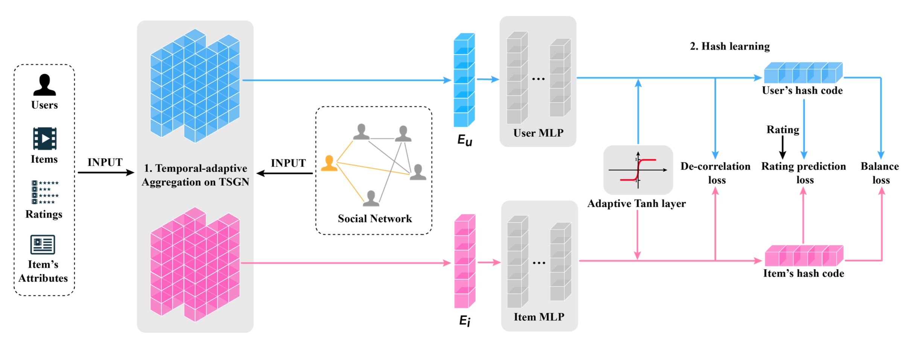

# TSGNH

This is the pytorch implementation of paper "Temporal Social Graph Network Hashing for Efficient Recommendation"




## Train

- Train the model using `python run.py`. All hyper-parameters are defined in `config.py`


## Citation

```
@article{xu2024temporal,
  title={Temporal Social Graph Network Hashing for Efficient Recommendation},
  author={Xu, Yang and Zhu, Lei and Li, Jingjing and Li, Fengling and Shen, Heng Tao},
  journal={IEEE Transactions on Knowledge and Data Engineering},
  year={2024},
  publisher={IEEE}
}

```